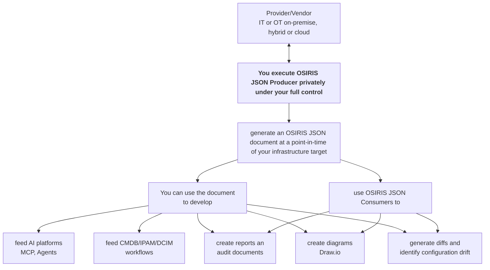

import { CardGrid, Card, Badge, Steps } from '@astrojs/starlight/components';

# What is an OSIRIS JSON Producer

an OSIRIS JSON producer is a super lightweight application [written in Go](https://go.dev/) available on Windows, MacOS, Linux that after being installed is able to **generate a private portable and normalized snapshot of your IT/OT on-premise, hybrid or cloud infrastructure** at a point in time **without need** of extra dependencies like third-party services or SaaS solutions, AI Platforms and MCP Servers. **You execute it on your workstation or a server under your full complete control.**

It connects directly **from your own environment** to infrastructure sources such as hyperscalers, public cloud and hosting providers, on-premise IT systems (like for example hypervisors,bare metal servers,storage,network etc.) and OT systems. It discovers inventory and topology data, normalizes proprietary informations and emits a valid OSIRIS JSON Document like [OSIRIS JSON IT infrastructure example](/examples/it-infrastructure/) and [OSIRIS JSON OT infrastructure example](/examples/ot-infrastructure/).

- **No** AI platform, MCP server or AI agent are required
- **No** SaaS or intermediary API are required
- **No** pay per use, license or expensive consultancy are required
- **No** additional software development is required
- Your infrastructure data stays under your control like your API keys or login credentials to retrieve the informations and generate an OSIRIS JSON document

OSIRIS JSON producer bridge the gap between proprietary infrastructure language/format and the freedom of an open, vendor-neutral JSON format.

### The OSIRIS JSON Producer Architecture High-Level Diagram


## What an OSIRIS JSON producers will do in detail

After installing it on your workstation or on a server of your choice, when you execute an OSIRIS JSON producer il will performs four steps:

<Steps>
	1. **Discovery** - The OSIRIS JSON producer connect using credentials (can be your user account or better a
	dedicated read-only service account or API keys) to the target platform or device of your choice and enumerate all
	resources within scope allowed by the assigned account/API permission.
	2. **Normalization** - Map vendor-specific data models into OSIRIS JSON
	resource types, connections and groups enriching other details if needed with specific flag usage.
	The data get normalized following the OSIRIS JSON Specification but without altering any original
	informations which remain intact.
	3. **Redaction and safety guardrails** - As per OSIRIS JSON
	Specification any secrets, credentials and other sensitive configuration values will be stripped
	before emitting the OSIRIS JSON document.
	4. **Emission** - it save a valid OSIRIS JSON document
	file. You can use the document as you like. For example with your AI platform or MCP server for
	enhanced reasoning without any need to connect AI/MCP to your infrastructure, or to create
	reports, schedule autogeneration for audit or configuration drift identification or you can use to
	feed CMDB/IPAM/DCIM or generate diagrams in Draw.io/Mermaidjs. OSIRIS JSON Consumer is under
	development once ready you would use the program to generate report and topology of your
	infrastructure with zero dependency and in total privacy.
</Steps>

## Available OSIRIS JSON producers

Producers are released incrementally while others are planned and will follow.
If you are using a platform or device not currently listed below we encourage you to [open a new discussion on GitHub](https://github.com/orgs/osirisjson/discussions/categories/roadmap).

### Hyperscalers Cloud and Hosting Providers

#### Hyperscalers

| Provider                                                           | Scope                                     | Status                                       |
| ------------------------------------------------------------------ | ----------------------------------------- | -------------------------------------------- |
| [Microsoft Azure](/osiris-producers/hyperscalers/microsoft-azure/) | Virtual Networks, VMs, Load Balancers     | <Badge text="available" variant="success" /> |
| [Amazon Web Services](/osiris-producers/hyperscalers/amazon-aws/)  | VPC, EC2, ELB, Transit Gateway            | <Badge text="available" variant="success" /> |
| Google Cloud Platform                                              | VPC, Compute Engine, Cloud Load Balancing | <Badge text="under development" variant="note" /> |
| Cloudflare														 | To be defined							 | <Badge text="planned" variant="default" /> |

#### Hosting and cloud providers

| Provider        | Scope                                 | Status                                |
| ------------- | ------------------------------------- | --------------------------------------- |
| Digital Ocean | Virtual Networks, VMs, Load Balancers | <Badge text="planned" variant="default" /> |
| Leaseweb      | Virtual Networks, VMs, Load Balancers | <Badge text="planned" variant="default" /> |

---
### On-Premise

#### Hypervisors

| Vendor     | Scope                           | Status                                  |
| ---------- | ------------------------------- | --------------------------------------- |
| Proxmox VE | Virtual Machines and Containers | <Badge text="under development" variant="note" /> |
| VMware     | Virtual Machines                | <Badge text="planned" variant="default" /> |

#### Network platforms

| Vendor                                    | Scope               | Status                                       |
| ----------------------------------------- | ------------------- | -------------------------------------------- |
| [Cisco](/osiris-producers/network/cisco/) | APIC, NX-OS, IOS-XE | <Badge text="available" variant="success" /> |
| Arista                                    | EOS                 | <Badge text="planned" variant="default" /> |
| HPE Aruba Networking Central              | EOS                 | <Badge text="under development" variant="note" /> |
| UniFi                                     | UniFi OS            | <Badge text="planned" variant="default" /> |


## Installing OSIRIS JSON Producers

see the [How to Install](/osiris-producers/installation/) page for install instructions.

## Typical workflow

For solution architects and auditors, the recommended workflow is:

<Steps>
	1. **Run the producer** against your target platform with appropriate credentials.
	2. **Validate
	the output** using `@osirisjson/cli` with the `strict` profile.
	3. **Review the snapshot** as an
	architecture artifact store it, compare it over time, attach it to audits.
</Steps>

```bash
# Generate snapshot
osirisjson-producer cisco apic -h apic.example.com -u admin > snapshot.json

# Validate
npx @osirisjson/cli validate --profile strict snapshot.json
```