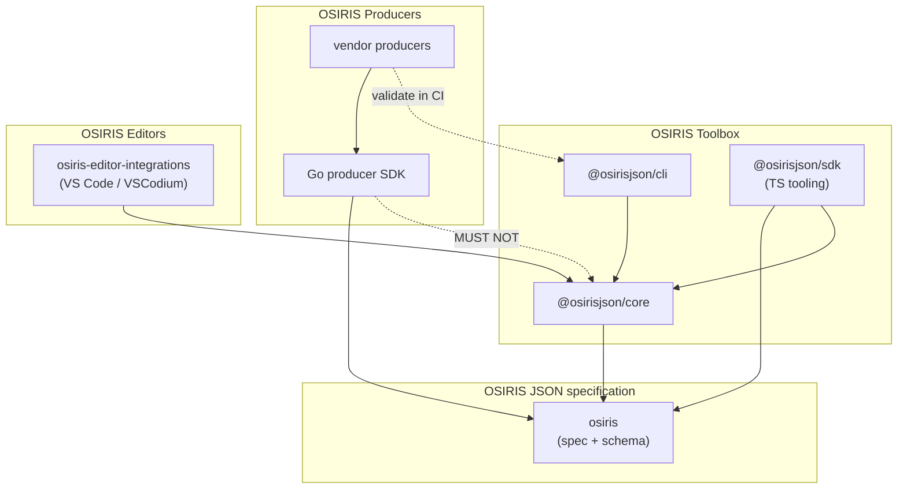
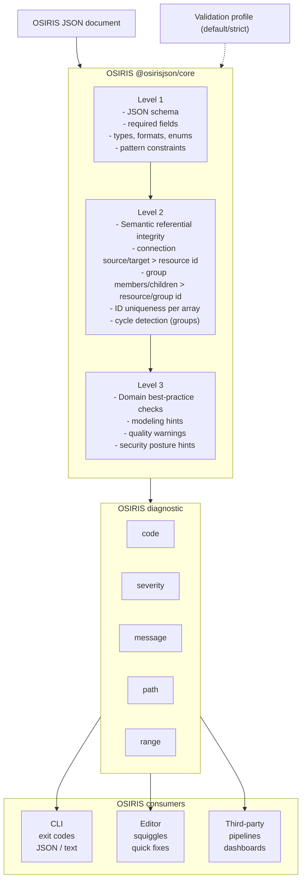

| Field              | Value                                                                                                        |
| ------------------ | ------------------------------------------------------------------------------------------------------------ |
| Authors            | Tia Zanella [skhell](https://github.com/skhell)                                                              |
| Revision           | 1.0.0-DRAFT                                                                                                  |
| Creation date      | 04 February 2026                                                                                             |
| Last revision date | 11 February 2026                                                                                             |
| Status             | Draft                                                                                                        |
| Document ID        | OSIRIS-ADG-1.0                                                                                               |
| Document URI       | [OSIRIS-ADG-1.0](https://github.com/osirisjson/osiris/tree/main/docs/guidelines/v1.0/OSIRIS-ARCHITECTURE.md) |
| Document Name      | OSIRIS JSON Architecture Development Guidelines                                                              |
| Specification ID   | OSIRIS-1.0                                                                                                   |
| Specification URI  | [OSIRIS-1.0](https://github.com/osirisjson/osiris/tree/main/specification/v1.0/OSIRIS-JSON-v1.0.md)          |
| Schema URI         | [OSIRIS-1.0](https://osirisjson.org/schema/v1.0/osiris.schema.json)                                          |
| License            | [CC BY 4.0](https://creativecommons.org/licenses/by/4.0/)                                                    |
| Repository         | [github.com/osirisjson/osiris](https://github.com/osirisjson/osiris)                                         |

# 1 Introduction

This document defines the architectural foundation for the OSIRIS ecosystem. It establishes the patterns, principles and repository structures required to build and evolve the OSIRIS core **toolbox**, **producers** and **editor-integrations** in a sustainable and scalable way.

These Architecture Development Guidelines prioritize:

| Priority             | Description                                                                                                                                                                 |
| -------------------- | --------------------------------------------------------------------------------------------------------------------------------------------------------------------------- |
| Neutrality           | OSIRIS producers and tooling prefer minimal dependencies to reduce supply-chain and maintenance drift, keeping implementations language-agnostic and sustainable long-term. |
| Modularity           | Components are independent and composable, enabling incremental adoption and isolated evolution                                                                             |
| Consistency          | Shared conventions and interfaces across producers and tools reduce ecosystem fragmentation                                                                                 |
| Quality              | Robust validation, reproducible fixtures and CI-driven regression coverage                                                                                                  |
| Developer experience | Clear APIs, predictable workflows and documentation that makes contributors productive quickly                                                                              |
| Extensibility        | A stable baseline for adding producers, integrations and validation capabilities without breaking existing workflows                                                        |

---

## 1.1 Developer navigation matrix

This document is intentionally lean and focuses on ecosystem **contracts**, **boundaries** and **architectural rules**.  
Implementation details live in focused guides and repository READMEs close to the code.

Use the matrix below to find the right entry point.

| If you are                                    | Reference URI                                                                                                                    | Will help you                                                                                         |
| --------------------------------------------- | -------------------------------------------------------------------------------------------------------------------------------- | ----------------------------------------------------------------------------------------------------- |
| **New to OSIRIS**                             | [OSIRIS-ADG-1.0](https://github.com/osirisjson/osiris/tree/main/docs/guidelines/v1.0/OSIRIS-ARCHITECTURE.md)                     | Understand the “why”, ecosystem boundaries and non-negotiable rules                                   |
| Implementing validation logic (rules)         | [OSIRIS-ADG-VL-1.0](https://github.com/osirisjson/osiris/tree/main/docs/guidelines/v1.0/OSIRIS-VALIDATION-LEVELS.md)             | Understand structural/semantic/domain validation and how to add or evolve rules safely                |
| Working on a producer (vendor integration)    | [OSIRIS-ADG-PR-1.0](https://github.com/osirisjson/osiris/tree/main/docs/guidelines/v1.0/OSIRIS-PRODUCER-GUIDELINES.md)           | Map vendor/platform data into OSIRIS consistently (IDs, resources, relationships, fixtures)           |
| Working on editor features (VS Code/VSCodium) | [OSIRIS-ADG-EI-1.0](https://github.com/osirisjson/osiris/tree/main/docs/guidelines/v1.0/OSIRIS-EDITOR-INTEGRATION-GUIDELINES.md) | Consume `@osirisjson/core` diagnostics, implement UX patterns and keep editor performance predictable |
| Working on versioning/releases                | [OSIRIS-ADG-VR-1.0](https://github.com/osirisjson/osiris/tree/main/docs/guidelines/v1.0/OSIRIS-VERSIONING-AND-RELEASES.md)       | Understand compatibility rules, publishing workflow and release alignment with schema versions        |
| Working on the CLI                            | [OSIRIS-ADG-TLB-CLI-1.0](https://github.com/osirisjson/osiris-toolbox/tree/main/docs/guidelines/v1.0/OSIRIS-TOOLBOX-CLI.md)      | Understand command orchestration, output formats and CI-friendly behaviors                            |
| Working on validation engine internals        | [OSIRIS-ADG-TLB-CORE-1.0](https://github.com/osirisjson/osiris-toolbox/tree/main/docs/guidelines/v1.0/OSIRIS-TOOLBOX-CORE.md)    | Understand schema loading, rule execution pipeline, diagnostics model and performance constraints     |
| Working on producer SDK internals             | [OSIRIS-ADG-PR-SDK-1.0](https://github.com/osirisjson/osiris-producers/tree/main/docs/guidelines/v1.0/OSIRIS-PRODUCER-SDK.md)    | Understand producer base classes, mapping helpers, ID strategy and shared utilities                   |
| Unsure where your change belongs              | Section “Repository boundaries” in this document                                                                                 | Choose the correct repo/package to avoid duplication and dependency violations                        |
| Working on the spec/schema itself             | [OSIRIS JSON specification](https://github.com/osirisjson/osiris/tree/main/specification/v1.0/OSIRIS-JSON-v1.0.md)               | Understand the OSIRIS spec, schema and normative examples                                             |
| Contributing rules & governance               | [OSIRIS community](https://osirisjson.org/en/docs/get-involved/community)                                                        | Understand how you can contribute to OSIRIS                                                           |

---

## 1.2 Architectural principles

### 1.2.1 Single source of truth

OSIRIS is designed to avoid fragmentation. The ecosystem must agree on **one** canonical definition of the format and **one** canonical implementation of validation behavior.

| Single source of truth sources                                                                                                                                                                                                                                                          | Non-negotiable rules                                                                                      |
| --------------------------------------------------------------------------------------------------------------------------------------------------------------------------------------------------------------------------------------------------------------------------------------- | --------------------------------------------------------------------------------------------------------- |
| **OSIRIS JSON specification** in the [OSIRIS](https://github.com/osirisjson/osiris/tree/main/specification/v1.0/OSIRIS-JSON-v1.0.md) repository and served through [osirisjson.org](https://osirisjson.org/en/docs/spec/v10/00-preface) are the authoritative definition of OSIRIS v1.0 | Producers **MUST NOT** store manipulated copies or add incompatible interpretations of the specification  |
| **OSIRIS core schema** in the [OSIRIS](https://github.com/osirisjson/osiris/tree/main/schema/v1.0/osiris.schema.json) repository and served through [osirisjson.org](https://osirisjson.org/schema/v1.0/osiris.schema.json) are the authoritative schema for OSIRIS v1.0                | Producers **MUST NOT** store manipulated copies or add incompatible interpretations of the core schema    |
| **OSIRIS schema endpoints** (e.g. `/schema/v1.0/`) are canonical for tooling resolution and editor integration                                                                                                                                                                          | Tooling **SHOULD** prefer `$schema` for resolution when available                                         |
| **OSIRIS validation engine** (`@osirisjson/core`) is the canonical implementation of validation behavior and diagnostic formatting                                                                                                                                                      | CLI and editor integrations **MUST NOT** re-implement validation logic that belongs to `@osirisjson/core` |

**Rationale:** a document validated in CI should behave the same in VS Code, in the CLI and in any consumer embedding `@osirisjson/core`. Tooling should work offline (schema may be bundled), but the endpoint remains canonical for versioned resolution.

### 1.2.2 Separation of concerns

OSIRIS splits the ecosystem into clear responsibilities to keep scaling sustainable.

| Roles                                                                                                                                                  | Boundaries                                                                                                |
| ------------------------------------------------------------------------------------------------------------------------------------------------------ | --------------------------------------------------------------------------------------------------------- |
| **Producers** translate source inventories (vendor APIs, compute, network, storage appliances, on-prem discovery, etc.) into **OSIRIS JSON documents** | Producers focus on mapping and data hygiene (identity stability, normalization, redaction)                |
| **Core validation** checks documents and emits **diagnostics** (structural, semantic, domain)                                                          | `@osirisjson/core` focuses on validation and diagnostics (no vendor APIs, no editor UI, no network calls) |
| **Consumers** (CLI, editors, other tooling) present or act on diagnostics and transform/visualize documents                                            | Consumers focus on UX and automation while delegating validation behavior to `@osirisjson/core`           |

**Rationale:** when each layer only does its job, the ecosystem remains predictable and contributors know where changes belong.

---

# 2 Physical architecture

## 2.1 Ecosystem structure

### 2.1.1 Repository layout (Polyrepo vs monorepo)

OSIRIS is developed across multiple repositories under the `osirisjson` GitHub organization. This structure separates **canonical specification content** from **tooling**, **vendor producers** and **editor integrations**, keeping responsibilities clear and enabling the ecosystem to scale as more producers and tools are added.

OSIRIS generated documents are standard **JSON** files and are expected to use the `.json` extension; consumers and tooling detect OSIRIS content via schema metadata and/or document structure rather than a custom file extension.

```text
osirisjson/
├── .github
│   ├── ISSUE_TEMPLATE/
│   ├── workflows/
│   ├── PULL_REQUEST_TEMPLATE.md
│   ├── CODE_OF_CONDUCT.md
│   ├── COMMUNITY_GUIDE.md
│   ├── FUNDING.yml
│   ├── GOVERNANCE.md
│   ├── MEMBERS.md
│   ├── README.md
│   ├── SECURITY.md
│   └── SUPPORT.md
├── osiris                      # Canonical specification, schema sources, guidelines and normative examples
├── osiris-toolbox              # NPM packages: core validation, IDEs/tooling SDK and CLI
│   ├── core
│   ├── sdk
│   └── cli
├── osiris-producers            # Producer SDK + vendor-specific producers (parsers/exporters)
├── osiris-editor-integrations  # Editor integrations (VS Code/VSCodium today; others later)
└── osiris-mcp                  # Future MCP server
```

### 2.1.2 Repository responsibilities

| osiris                                                           | osiris-toolbox                                                                                                        | osiris-producers                                                                                                               | osiris-editor-integrations                                               | .github                                                     | osiris-mcp                                                                   |
| ---------------------------------------------------------------- | --------------------------------------------------------------------------------------------------------------------- | ------------------------------------------------------------------------------------------------------------------------------ | ------------------------------------------------------------------------ | ----------------------------------------------------------- | ---------------------------------------------------------------------------- | ------------------------------------------------------------------- |
| Canonical OSIRIS JSON specification aligned to released versions | OSIRIS JSON Core validation engine (structural, semantic and domain validation)                                       | Vendor-specific producer implementations (e.g. Cisco NX-OS, Azure)                                                             | Real-time OSIRIS JSON validation powered by the shared validation engine | -                                                           | Community health files, contribution templates and security/support policies | MCP server implementation for automation and ecosystem integrations |
| Canonical OSIRIS JSON core schema aligned to released versions   | OSIRIS JSON Schema validation with enhanced, user-friendly error reporting                                            | Shared producer utilities and fixtures where vendor-specific reuse is needed                                                   | Schema-aware autocomplete and navigation                                 | Standardized issue and PR workflows across all repositories | -                                                                            |
| Docs and guidelines to support development and project grow      | Shared error model and diagnostics format consumed by CLI and editor integrations                                     | Integration and regression test suites per producer                                                                            | Rich diagnostics with actionable messages and quick fixes                | -                                                           | -                                                                            |
| Normative examples referenced by the specification               | OSIRIS JSON TypeScript SDK for IDEs and tooling consumers (document types, diagnostic utilities, integration helpers) | OSIRIS JSON Producer SDK for producers transport primitives, normalization helpers, ID generation and shared producer patterns | Future integrations (e.g. draw.io export/preview workflows)              | -                                                           | -                                                                            |
| Change log and release notes                                     | OSIRIS JSON CLI tool for validation and conversion workflows                                                          | Producer documentation (configuration, permissions, examples) inside each producer package                                     | -                                                                        | -                                                           | -                                                                            |
| -                                                                | Utility functions for OSIRIS JSON document manipulation and analysis                                                  | -                                                                                                                              | -                                                                        | -                                                           |

#### Repository boundaries

Use these rules to avoid duplication and circular dependencies:

- Format definition changes (fields, semantics, namespaces, examples) belong in `osiris`
- Validation behavior changes (rule logic, diagnostics shape) belong in `@osirisjson/core`
- IDEs and tooling consumers helpers (document types, diagnostic utilities, integration helpers) belong in `@osirisjson/sdk`
- Producer ergonomics (transport, ID generation, normalization, golden fixtures) belong in the Go producer SDK within `osirisjson-producer`
- Command UX / CI behavior (flags, exit codes, output formats, orchestration) belong in `@osirisjson/cli`
- Vendor integrations (API calls, auth, inventory mapping, vendor-specific quirks) belong in `osirisjson-producer`
- IDE UX (language features, UI performance, quick fixes) belong in `osiris-editor-integrations`

---

## 2.2 The toolbox monorepo (@osirisjson/\*)

The toolbox monorepo is the shared foundation of the OSIRIS ecosystem. It provides reusable libraries so that each consumer does not implement its own OSIRIS logic.

### 2.2.1 @osirisjson/core: The validation engine

The purpose is to validate OSIRIS JSON documents and emit deterministic, tool-friendly diagnostics.

| Responsibilities                                                                                  | Non-goals                                                                   | Typical usage pattern                                         |
| ------------------------------------------------------------------------------------------------- | --------------------------------------------------------------------------- | ------------------------------------------------------------- |
| Load and apply OSIRIS JSON Schema validation (Level 1 structural)                                 | No vendor API integrations or inventory fetching                            | `@osirisjson/cli`                                             |
| Execute semantic integrity checks (Level 2 referential integrity, uniqueness, format constraints) | No editor UI logic, no CLI orchestration                                    | VS Code/VSCodium extension (directly or through an LSP layer) |
| Execute optional best-practice checks (Level 3 domain rules)                                      | No network calls during validation (schema resolution must be local/cached) | Third-party tools embedding validation in pipelines           |
| Emit diagnostics in a stable data model consumed by CLI and editor integrations                   | -                                                                           | -                                                             |
| Provide validation profiles (e.g. default vs strict) without changing rule meaning                | -                                                                           | -                                                             |

### 2.2.2 @osirisjson/sdk: IDEs and tooling SDK

The purpose is to provide reusable TypeScript building blocks for tools that consume or manipulate OSIRIS JSON documents (editors, dashboards, import pipelines).

| Responsibilities                                                                          | Non-goals                                                                 | Typical usage pattern                                   |
| ----------------------------------------------------------------------------------------- | ------------------------------------------------------------------------- | ------------------------------------------------------- |
| TypeScript type definitions for OSIRIS JSON documents, diagnostics and validation results | No vendor-specific mapping logic (that belongs in `osirisjson-producers`) | Editor integrations consuming `@osirisjson/core` output |
| Document manipulation helpers (merge, filter, transform)                                  | No "hidden validation fork": canonical validation is `@osirisjson/core`   | Third-party tools building on OSIRIS                    |
| Integration utilities for embedding validation results in custom UIs or pipelines         | No acquisition or transport logic (HTTP, SSH, NETCONF)                    | CI/CD tooling beyond the standard CLI                   |

### 2.2.3 @osirisjson/cli: Command Line Interface

The purpose is to provide a CI-friendly and developer-friendly interface to validate and process OSIRIS JSON documents.

| Responsibilities                                                                                                            | Non-goals                                                               | Typical usage pattern                           |
| --------------------------------------------------------------------------------------------------------------------------- | ----------------------------------------------------------------------- | ----------------------------------------------- |
| Command orchestration and filesystem IO                                                                                     | No validation re-implementation (always delegate to `@osirisjson/core`) | Local: `npx @osirisjson/cli validate file.json` |
| Invoking `@osirisjson/core` and presenting results                                                                          | No editor-specific UX assumptions                                       | CI: exit codes + --format json                  |
| Stable exit codes for CI/CD                                                                                                 | -                                                                       | -                                               |
| Machine-readable output (JSON) and human output (text)                                                                      | -                                                                       | -                                               |
| (Optional) conversions that do not change OSIRIS semantics (e.g. formatting, normalization modes) when explicitly requested | -                                                                       | -                                               |

---

## 2.3 The producer repository (osiris-producers)

The producer repository contains first-party Go producers and the Go producer SDK. It is separate from the toolbox because producers have different runtime concerns (transport, concurrency, vendor APIs) and a different primary language.

**Command contract:**
`osirisjson-producer <vendor> [subcommand] [flags]`
The osirisjson-producer CLI is designed as a dispatcher. Vendor backends are treated as interchangeable executables and **MAY** be implemented in any language (Go, C, Rust, etc.), provided they are invoked by the dispatcher, emit a valid OSIRIS JSON document and follow the tool’s standard behavior (stdout for the document, stderr for diagnostics, exit codes).

### 2.3.1 Go producer SDK

The purpose is to provide reusable Go building blocks for building vendor-specific OSIRIS producers with minimal external dependencies.

| Responsibilities                                                                            | Non-goals                                                                                                                       |
| ------------------------------------------------------------------------------------------- | ------------------------------------------------------------------------------------------------------------------------------- |
| Transport primitives (HTTP, SSH exec, NETCONF) with auth helpers (OAuth2, AWS SigV4, basic) | No validation logic (canonical validation is `@osirisjson/core`)                                                                |
| Deterministic ID generation and canonicalization                                            | No editor or IDE integration                                                                                                    |
| OSIRIS JSON document assembly (typed structs, JSON marshaling, metadata/scope helpers)      | Producer SDK may define producer runtime errors; OSIRIS validation diagnostics remain the responsibility of `@osirisjson/core`. |
| Normalization utilities (units, timestamps, casing)                                         | -                                                                                                                               |
| Test harness (golden fixtures, snapshot comparison)                                         | -                                                                                                                               |

---

## 2.4 Dependency graph and stability rules

### 2.4.1 The "forbidden direction" rule

OSIRIS packages are layered to prevent circular dependencies and to keep the validation engine portable.
Dependencies **MUST** only flow “down” towards more foundational layers.

- `@osirisjson/core` **MUST NOT** depend on `@osirisjson/sdk`, `@osirisjson/cli`, `osiris-producers`, or any editor integration.
- `@osirisjson/cli` **MAY** depend on `@osirisjson/core`.
- `@osirisjson/sdk` **MUST** remain usable without requiring `@osirisjson/cli` or editor code.
- osiris-editor-integrations like a VS code extension **MUST** delegate validation to `@osirisjson/core` and **MUST NOT** ship incompatible validation logic.
- Go producers `osirisjson-producer` (e.g. `osirisjson-producer cisco --ssh ...`) use the Go producer SDK at runtime and **MUST NOT** depend on `@osirisjson/core` as a library. Canonical validation is invoked via `@osirisjson/cli` in CI (e.g. `npx @osirisjson/cli validate <OSIRIS JSON document>`).

A typical dependency direction looks like this:



### 2.4.2 Version alignment strategy

OSIRIS versioning is designed to keep the ecosystem compatible while allowing evolution.

**Document and schema rules (OSIRIS v1.0)**

- Documents declare `version` as **MAJOR.MINOR.PATCH** (SemVer semantics)
- The v1.0 schema endpoint accepts any `1.x.y` document version
- Producers **MAY** include `$schema`. Other top-level fields **SHOULD NOT** be emitted
- Consumers **MUST** ignore unknown fields for forward compatibility

**Toolbox alignment principles**

- Toolbox packages **MUST** share the same `MAJOR` version across `@osirisjson/core`, `@osirisjson/sdk` and `@osirisjson/cli`
- `@osirisjson/cli` **MUST** be compatible with the corresponding `MAJOR` of `@osirisjson/core`
- Producers and extensions **SHOULD** declare which OSIRIS `MAJOR` they support (documentation and/or package metadata)
- Breaking changes to diagnostic shapes, rule identifiers, or CLI contract **MUST** be a toolbox `MAJOR` bump

**Rationale:** a stable major alignment prevents ecosystem “split brain” where producers, editors and CI disagree on what “valid” means.

---

## 2.5 Implementation platform rationale (TypeScript + NPM) (Non-normative)

OSIRIS is language-agnostic at the document level: any producer in any language is valid if it emits OSIRIS JSON that validates against the core schema and passes the canonical validation engine in CI.
The OSIRIS **canonical toolbox** (validation engine + CLI + reference SDK) is built on **TypeScript** and distributed as **NPM packages** to maximize reuse across CLI and editor integrations.

### Decision summary

- **Canonical toolbox platform:** Node.js + TypeScript
- **Toolbox distribution:** NPM packages (SemVer-aligned)
- **Producers:** Any language is supported; first-party producers are **recommended in Go** for portability and scale
- **Canonical truth rule:** validation behavior and diagnostic shape are defined by `@osirisjson/core` and must not be re-implemented elsewhere

### Why TypeScript/NPM for the toolbox

The main drivers are **ecosystem alignment** and **code reuse**:

- IDEs like VS Code/VSCodium extensions run on Node: sharing diagnostics/schema/validation logic is direct
- One runtime for CLI + core + editor integrations reduces “split brain” behavior and duplication
- NPM makes SemVer alignment and dependency composition straightforward for an ecosystem.
- TypeScript provides strong typing for diagnostics, rule APIs and SDK builders without sacrificing iteration speed.

### Why Go for producers

Producers are made of acquisition and parsing systems: transport (HTTP/SSH/NETCONF), concurrency, normalization and vendor quirks.
Go is highly recommended for first-party producers because it supports:

- Portable deployment (single binary, cross-compilation)
- High-throughput polling/collection (concurrency, predictable memory)
- Long-term maintainability (stdlib-first approach for HTTP/JSON/XML/TLS/crypto/regex)

This does not change OSIRIS interoperability: producers still emit OSIRIS JSON and validate via the canonical toolbox in CI.

### Two SDKs by audience

To avoid mixing concerns, OSIRIS treats “SDK” as audience-specific:

- **Tooling SDK (TypeScript):** aligns with `@osirisjson/core` contracts and editor integrations (`@osirisjson/sdk` in the toolbox).
- **Producer/acquisition SDK (Go):** lives with Go producers and provides transport and normalization helpers for building exporters at scale.

### Comparison matrix (toolbox reference implementation)

| Criteria                                                  | TypeScript (Node/NPM)      | Go                                          | Python                 | Rust                    |
| --------------------------------------------------------- | -------------------------- | ------------------------------------------- | ---------------------- | ----------------------- |
| IDE extension (initially VScode/Codium) runtime alignment | Excellent (native)         | Medium (bridge needed)                      | Medium (bridge needed) | Medium (bridge needed)  |
| Sharing code between CLI/core/extension                   | Excellent                  | Medium                                      | Medium                 | Medium                  |
| Distribution to devs                                      | Excellent (`npm i`, `npx`) | Good (binaries)                             | Good (pip)             | Medium (cargo/binaries) |
| Type safety for contracts (diagnostics/rules)             | Strong                     | Strong                                      | Weak/Optional          | Very strong             |
| Performance for large graphs                              | Good                       | Very good                                   | Medium                 | Very good               |
| Build complexity for contributors                         | Low                        | Medium                                      | Low                    | High                    |
| Ecosystem reach for infra scripting                       | High                       | High                                        | Very high              | Medium                  |
| Cross-platform UX                                         | High                       | High                                        | Medium (env friction)  | Medium/High             |
| Best fit for “canonical shared validator”                 | Yes                        | Possible (but defeats editor/runtime reuse) | Possible               | Possible                |

**Conclusion:**
TypeScript/NPM remains the most pragmatic choice for the **canonical toolbox** because it maximizes reuse across CLI+core+editor integrations with the lowest contributor friction. Go for producers remain first-class providing strong performance in complex scenarios generating large snapshots.

### Guidance for non-Go producers

- Emit OSIRIS JSON with `$schema`.
- Validate in CI using `@osirisjson/core` (via CLI) to match canonical behavior.
- Use golden fixtures to prevent drift across releases.

### Specialized producers (C/Rust etc.) (Non-normative)

OSIRIS is language-agnostic. While first-party producers are generally recommended in Go, some environments like OT landscape require lower-level implementations.

In constrained or realtime OT landscapes, producers/collectors **MAY** be implemented in **C**, **Rust** or other languages, for example:

- bare-metal or RTOS targets
- hard-realtime sampling loops with strict requirements
- very small memory/flash budgets
- direct serial/fieldbus/proprietary binary protocols (e.g. RS-485/Modbus RTU, BACnet MS/TP, CAN)

In these cases, C/Rust producers **SHOULD** be treated as **edge collectors** focused on acquisition.

They **SHOULD** either:

- emit OSIRIS JSON on a gateway/system that can run validation
- emit a minimal intermediate payload to a gateway which performs normalization and produces OSIRIS JSON.

Regardless of implementation language, all produced OSIRIS JSON documents **MUST** be validated in CI using the canonical TypeScript validation engine (`@osirisjson/core`) to prevent rule drift.

---

# 3 Logical architecture (Data Flow pipelines)

## 3.1 The ingestion pipeline (Producer lifecycle)

The ingestion pipeline describes how producers create an OSIRIS snapshot from source systems.
It is intentionally described as a **contract-level lifecycle**; implementation details belong in [OSIRIS-ADG-PR-1.0](https://github.com/osirisjson/osiris/tree/main/docs/guidelines/v1.0/OSIRIS-PRODUCER-GUIDELINES.md) and the OSIRIS Go producer SDK.

### 3.1.1 Context and scope

Producers **MUST** establish explicit export context before emitting an OSIRIS JSON document.

- `metadata.timestamp` reflects when the snapshot was generated (ISO 8601 with timezone)
- `metadata.generator` identifies the producer/tool name and version
- `metadata.scope` describes what the snapshot represents (e.g. providers, accounts/subscriptions, regions, sites, environments) and any known limitations

**Guidance**

- If inventory is incomplete, producers **SHOULD** still export what they know and document limitations in `metadata.scope.description` (or equivalent) rather than failing silently.
- Very large infrastructures **MAY** be split into multiple documents (e.g. per region/environment/account). Scope **MUST** make boundaries explicit.

### 3.1.2 Normalization

Normalization makes documents comparable over time and across producers. It standardizes **representation**, not meaning (normalization **MUST NOT** introduce artifacts).

Producers **SHOULD**:

- Normalize provider naming and stable identifiers under `provider`
- Prefer stable field representations (e.g. consistent casing and units)
- Avoid embedding volatile, noise-heavy values unless they are essential for the intended use case
- Produce diff-friendly output where feasible (e.g. stable ordering of arrays such as sorting by `id`)

---

## 3.2 The validation pipeline (Core engine)

Validation is executed by `@osirisjson/core` and emits diagnostics. Validation is defined in terms of **levels**; see [OSIRIS-ADG-VL-1.0](https://github.com/osirisjson/osiris/tree/main/docs/guidelines/v1.0/OSIRIS-VALIDATION-LEVELS.md) for the full model and catalog.
Validation **profiles** (e.g. default vs strict) may change which checks run and how results are reported, but **MUST NOT** change the meaning of a rule.

### 3.2.1 Stage 1: Structural (Schema)

| Goal                          | Check examples                                              | Outcome                                                             |
| ----------------------------- | ----------------------------------------------------------- | ------------------------------------------------------------------- |
| Verify JSON Schema compliance | Required fields present (`version`, `metadata`, `topology`) | Diagnostics that point to precise locations and schema expectations |
| -                             | Field types and formats (strings, objects, arrays, enums)   | -                                                                   |
| -                             | Schema constraints (e.g. `direction` enum)                  | -                                                                   |

### 3.2.2 Stage 2: Semantic (Integrity)

| Goal                                                       | Check examples                                                                            | Outcome                                                             |
| ---------------------------------------------------------- | ----------------------------------------------------------------------------------------- | ------------------------------------------------------------------- |
| Verify internal consistency beyond what schema can express | Referential integrity: connections and groups reference existing IDs in the same document | Deterministic diagnostics that do not depend on runtime environment |
| -                                                          | ID uniqueness within each array                                                           | -                                                                   |
| -                                                          | Cycle detection where applicable (e.g. group hierarchy)                                   | -                                                                   |
| -                                                          | Basic canonical constraints (e.g. invalid self-references)                                | -                                                                   |

### 3.2.3 Stage 3: Domain (Best practices)

| Goal                                                                                   | Check examples                                                                   | Outcome                                                                                                                        |
| -------------------------------------------------------------------------------------- | -------------------------------------------------------------------------------- | ------------------------------------------------------------------------------------------------------------------------------ |
| Optional, opinionated checks that improve quality without changing structural validity | Modeling recommendations (e.g. prefer `properties`/`extensions` over new fields) | Domain rules are not a replacement for a CMDB, a scanner or vendor tooling. They exist to improve interoperability and quality |
| -                                                                                      | Quality hints (e.g. missing `provider.native_id` where expected)                 | -                                                                                                                              |
| -                                                                                      | Security posture hints when safe and non-invasive                                | -                                                                                                                              |

---

## 3.3 The consumption pipeline (CLI and Editors)

Consumers are responsible for presenting and acting on validation outcomes.
CLI and editors **MUST** delegate validation behavior to `@osirisjson/core` (no duplicated validators).

**CLI pipeline:**

- Read files and resolve schema (offline/local).
- Run `@osirisjson/core` validation with a chosen profile.
- Emit:
  - stable exit codes for CI
  - machine-readable results (JSON)
  - human-readable summaries

**Editor pipeline (Visual Studio Code/VSCodium):**

- Detect OSIRIS JSON documents (via `$schema` and/or document structure)
- Validate via `@osirisjson/core` (directly or via LSP)
- Render diagnostics (squiggles, hovers, quick fixes)
- Enforce performance constraints (debounce, incremental parsing, avoid UI blocking)

---

# 4 Core architectural patterns

This chapter defines the ecosystem patterns that keep OSIRIS toolbox consistent across CLI, editors, producers and third-party consumers.

---

## 4.1 Diagnostics and error handling

Diagnostics are the common language across the OSIRIS ecosystem. They **MUST** be stable, structured and tool-friendly.



### 4.1.1 The diagnostic model

A **diagnostic** represents a single validation finding emitted by `@osirisjson/core`.

**Minimum fields**
| Field | Meaning |
|---|---|
| `code` | Stable identifier for the finding as defined by the OSIRIS JSON specification for the targeted `version` (treat as opaque string; meaning MUST NOT change within a spec `MAJOR`). |
| `severity` | One of `error`, `warning`, `info` (spec-defined severities). |
| `message` | Human-readable explanation (not normative; may evolve for clarity/localization). |
| `path` | A stable locator to the relevant value (JSON Pointer RFC 6901 RECOMMENDED; equivalent stable locator accepted). |

**Optional fields**
| Field | Meaning |
|---|---|
| `range` | Document range `{start,end}` with `{line,character}` when source text is available (0-based, LSP-style recommended). |
| `rule` | Implementation-defined rule key (optional). `code` remains the primary contract identifier. |
| `related` | Related locations for cross-reference issues (e.g. “also referenced here”). |
| `fix` | Structured quick-fix metadata (only when safe, deterministic and non-destructive). |

**Example (illustrative, not normative):**

```json
{
	"code": "V-REF-002",
	"severity": "error",
	"message": "Connection target references non-existent resource 'aws::db-nonexistent'.",
	"path": "/topology/connections/0/target",
	"range": {
		"start": { "line": 220, "character": 18 },
		"end": { "line": 220, "character": 44 }
	}
}
```

:::note
Rule definitions and canonical code meanings are specified in the [OSIRIS-JSON-v1.0](https://github.com/osirisjson/osiris/tree/main/specification/v1.0/OSIRIS-JSON-v1.0.md).
The engine input/output contract and profile mapping are defined in [OSIRIS-ADG-VL-1.0](https://github.com/osirisjson/osiris/tree/main/docs/guidelines/v1.0/OSIRIS-VALIDATION-LEVELS.md).
:::

### 4.1.2 Severity guidance and profiles

Diagnostics separate what failed `code` from how serious it is `severity`. Severity may depend on the active validation profile (e.g. default vs strict), but codes must not change meaning.

**General guidance:**

- **Structural (Level 1)** violations are typically error.
- **Semantic (Level 2)** violations are typically error (broken references, duplicate IDs), but some may be downgraded under non-strict profiles.
- **Domain (Level 3)** findings are typically warning, info, or hint.

The authoritative rule catalog and mapping live in [OSIRIS-ADG-VL-1.0](https://github.com/osirisjson/osiris/tree/main/docs/guidelines/v1.0/OSIRIS-VALIDATION-LEVELS.md) and are implemented in `@osirisjson/core`

---

## 4.2 Identity strategy (deterministic IDs)

Stable identity is what makes OSIRIS useful for diffs, correlation and long-lived tooling.

**Core rules:**
Resource, connection and group IDs **MUST** be unique within a document.

- IDs **SHOULD** remain stable across exports when feasible.
- IDs are opaque identifiers: consumers **SHOULD NOT** require parsing ID structure.

**Recommended producer strategy:**
| Entity | Recommended approach |
|---|---|
| Resources | Prefer stable provider identifiers and preserve them under `provider.native_id` when available. Use deterministic `id` generation when no stable native identifier exists. |
| Connections | Generate deterministic connection IDs from stable endpoint fingerprints. For `direction = "bidirectional"`, canonicalize endpoint ordering to prevent ID flips. |
| Groups | Generate stable IDs derived from stable boundaries (region/site/datacenter/rack/env, hyperscaler/cloud object IDs, etc.). Groups **SHOULD** remain stable across exports even when temporarily empty. |

**Rationale:** stable IDs enable meaningful topology diffs and downstream correlation without vendor-specific logic.

---

## 4.3 Extensibility mechanism

OSIRIS is designed to evolve without breaking consumers.

**Forward-compatibility rules:**

- Consumers **MUST** ignore unknown fields (including unknown extension payloads).
- Producers **SHOULD NOT** introduce new top-level fields in v1.0 beyond optional `$schema`.

**Where to put additional data:**
| Need | Use |
|---|---|
| Generic, broadly useful extra attributes | `properties` |
| Vendor/org-specific payloads, schemas, or deep objects | `extensions` (namespaced keys) |

**Namespace governance:**

- Extension keys **MUST** follow `osiris.<identifier>` naming rules (lowercase, dot-separated).
- The `osiris.` prefix is reserved to prevent collisions and support registry conventions.
- OSIRIS governs namespace rules (and optionally a registry), not the internal semantics of each extension payload.
- Consumers **MUST** treat unknown extension fields as opaque.

---

## 4.4 JSON file conventions

These conventions keep OSIRIS JSON documents portable, editor-friendly and diff-friendly.

### 4.4.1 File format

- Documents **MUST** be valid JSON format adhering to [RFC8259](https://datatracker.ietf.org/doc/html/rfc8259).
- Canonical OSIRIS JSON documents **MUST NOT** use comments (`jsonc`).
- Character encoding **MUST** be in `UTF-8` adhering to [RFC8259](https://datatracker.ietf.org/doc/html/rfc8259).
- Documents are expected to use the `.json` extension (tools detect OSIRIS via `$schema` and/or structure).

### 4.4.2 Top-level fields

- Producers **MAY** include `$schema` (recommended for tooling/editor resolution).
- Other top-level fields **SHOULD NOT** be emitted in OSIRIS v1.0.

### 4.4.3 Recommended ordering and diffs

- Prefer consistent key ordering for common objects (at least at the top level).
- Prefer stable ordering for arrays when it does not change semantics:
  - `topology.resources` sorted by `id`
  - `topology.connections` sorted by `id`
  - `topology.groups` sorted by `id`
- Avoid nondeterministic iteration order that creates noisy diffs.

### 4.4.4 Recommended formatting

- 2-space indentation
- newline at end of file

---

## 4.5 Terminology

| Term                  | Description                                                                                                  |
| --------------------- | ------------------------------------------------------------------------------------------------------------ |
| Document              | A single OSIRIS JSON file representing a point-in-time snapshot.                                             |
| Producer              | A software component that produces an OSIRIS JSON document from a source inventory.                          |
| Consumer              | A software component that reads OSIRIS JSON documents (validator, diagrammer, diff engine, inventory, etc.). |
| Topology              | The `topology` object containing resources, connections and groups.                                          |
| Resource              | An entity described in `topology.resources`.                                                                 |
| Connection            | A relationship/edge described in `topology.connections`.                                                     |
| Group                 | A container/hierarchy described in `topology.groups`.                                                        |
| Properties            | Freeform attributes for broadly useful non-standard data.                                                    |
| Extensions            | Namespaced payloads for vendor/org-specific data.                                                            |
| Diagnostics           | Structured validation findings emitted by `@osirisjson/core`.                                                |
| Structural validation | Schema-based validation (Level 1).                                                                           |
| Semantic validation   | Referential integrity and consistency checks (Level 2).                                                      |
| Domain validation     | Optional best-practice checks (Level 3).                                                                     |

---

## 4.6 Stability tiers

This table defines which ecosystem surfaces are expected to remain stable within a `MAJOR` version.

| Artifact/Surface                          | Stability within MAJOR | What is stable                                                                                                                                                                                                                   | What may change                                                                                                     |
| ----------------------------------------- | ---------------------- | -------------------------------------------------------------------------------------------------------------------------------------------------------------------------------------------------------------------------------- | ------------------------------------------------------------------------------------------------------------------- |
| OSIRIS JSON specification (`osiris`)      | High                   | Field meanings, normative rules, namespace rules                                                                                                                                                                                 | Clarifications, additional guidance, new optional fields/features in `MINOR` (non-breaking)                         |
| Schema endpoint (`/schema/v1.0/...`)      | High                   | Validators **MAY** accept `1.x.y` at the `v1.0` endpoint; producers targeting `v1.0` **MUST** emit `1.0.0`. `version` is the OSIRIS format version, not the producer version. Producer `version` belongs in `metadata.generator` | Adds new optional fields / clarifications; Schema **MUST NOT** tighten constraints for existing fields within v1.x. |
| `@osirisjson/core` public API             | High                   | Validator entry points, diagnostic shape, severity model                                                                                                                                                                         | Internal pipeline, performance optimizations, new rules                                                             |
| Diagnostic codes catalog                  | Medium/High            | Existing codes retain meaning once published                                                                                                                                                                                     | New codes added; deprecations announced before `MAJOR` removal                                                      |
| `@osirisjson/cli` contract                | High                   | Command names, exit codes, JSON output format promises                                                                                                                                                                           | New flags/options, improved formatting                                                                              |
| `@osirisjson/sdk` contract                | Medium                 | Core helpers and base patterns                                                                                                                                                                                                   | New helpers, refactors, optional utilities (avoid breaks without `MAJOR`)                                           |
| Producer SDK contract                     | Medium                 | Transport interfaces, ID generation, normalization helpers                                                                                                                                                                       | New utilities, refactors (avoid breaks without `MAJOR`)                                                             |
| Producers (`osiris-producers`)            | Medium                 | Supported vendors/scopes per producer (documented)                                                                                                                                                                               | Coverage changes as vendor APIs or platforms evolve                                                                 |
| Extensions (`osiris-editor-integrations`) | Medium                 | Delegation to `@osirisjson/core`, editor performance constraints                                                                                                                                                                 | UI/UX improvements, new features                                                                                    |

---

# 5 Cross-Cutting concerns

Cross-cutting concerns **apply to all** OSIRIS components (producers, validation engine, CLI, editor integrations and any third-party consumers). These rules exist to keep the ecosystem reliable, safe and predictable at scale.

---

## 5.1 Performance constraints

OSIRIS tooling must remain reliable on **large documents** and in **interactive environments**.

| Ecosystem expectations                                                                                                      | Guidance                                                                                                                                        |
| --------------------------------------------------------------------------------------------------------------------------- | ----------------------------------------------------------------------------------------------------------------------------------------------- |
| Validation **SHOULD** be linear-time where possible (single-pass indexing + lookups).                                       | `@osirisjson/core` should build indexes once (e.g. `id` > `location`) and reuse them across checks.                                             |
| Schema loading **MUST** be available offline/local and **SHOULD** be cached (no network dependency during validation runs). | Consumers **MAY** resolve `$schema` via local cache/bundled schema; the canonical endpoint remains authoritative for versioned resolution.      |
| Editors **MUST** debounce validation and **MUST NOT** block the UI thread.                                                  | Prefer incremental parsing, background workers and “validate-on-idle” strategies for large documents.                                           |
| Diagnostics emission **SHOULD** be bounded and predictable (avoid flooding).                                                | Cap repeated errors (e.g. “first `N` occurrences”), group similar findings and prefer high-signal messages.                                     |
| Producers **SHOULD** support partitioning for very large infrastructures.                                                   | Producers **MAY** split exports by logical boundaries (region, account, environment, site). `metadata.scope` **MUST** make boundaries explicit. |

---

## 5.2 Security and redaction

OSIRIS is an interchange format. It **MUST** be safe to share under controlled policies. Producers and tooling **MUST** prevent accidental disclosure of secrets.

| Ecosystem expectations  | Producer requirements                                                                                                                                 | Operational guidance                                                                                                           |
| ----------------------- | ----------------------------------------------------------------------------------------------------------------------------------------------------- | ------------------------------------------------------------------------------------------------------------------------------ |
| Data minimization       | Producers **SHOULD** include only the minimum data required for the intended use case.                                                                | Organizations **SHOULD** classify exports (e.g. `prod` vs `dev`, `audience`, `retention`) according to internal policy.        |
| No secrets in documents | OSIRIS JSON documents **MUST NOT** contain credentials, secrets, or authentication material (passwords, tokens, API keys, private keys, secret keys). | Apply access controls, encryption at rest and retention policies aligned to classification.                                    |
| Redaction and detection | Producers **MUST** exclude known secret-bearing fields and **SHOULD** scan for common credential patterns before emission.                            | Treat OSIRIS snapshots as potentially sensitive: restrict sharing, log access and rotate credentials if exposure is suspected. |
| Safe failure behavior   | Producers **SHOULD** fail the export or emit a clear error if credentials are detected.                                                               | Prefer “fail closed” for regulated environments; document redaction strategy and limitations.                                  |
| Document intent         | Producers **SHOULD** document intended audience and purpose using `metadata.scope` (or equivalent descriptive metadata).                              | Use scope to support automated policies (e.g. forbid publishing “prod” exports to public locations).                           |

---

# 6 References

This chapter lists normative and informative references used in the OSIRIS architecture and guidelines.

---

## 6.1 Normative references

The following documents are referenced normatively in this specification. Implementers **MUST** consult these references to fully understand OSIRIS requirement levels and terminology.

### RFC2119

**Key words for use in RFCs to indicate requirement levels**
[https://www.rfc-editor.org/rfc/rfc2119](https://www.rfc-editor.org/rfc/rfc2119)
Defines the normative keywords MUST, MUST NOT, REQUIRED, SHALL, SHALL NOT, SHOULD, SHOULD NOT, RECOMMENDED, MAY and OPTIONAL used throughout this specification.

### RFC3339

**Date and Time on the Internet: Timestamps**
[RFC3339](https://datatracker.ietf.org/doc/html/rfc3339)
Defines defines a date and time format for use in Internet protocols that is a profile of the ISO 8601 standard for representation of dates and times using the Gregorian calendar.

### RFC5737

**IPv4 Address Blocks Reserved for Documentation**
[RFC 5737](https://datatracker.ietf.org/doc/html/rfc5737)
Defines the three IPv4 unicast address blocks reserved for use in examples in OSIRIS JSON specifications and other documents.

### RFC8259

**The JavaScript Object Notation (JSON) data interchange format**
[https://www.rfc-editor.org/rfc/rfc8259](https://www.rfc-editor.org/rfc/rfc8259)
Defines the JSON data format used as the foundation for OSIRIS JSON documents.
