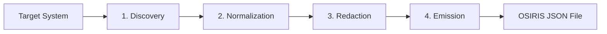

import { Steps, Aside } from '@astrojs/starlight/components';

This document details the software design patterns, implementation workflows, and requirements for building a discovery agent (Producer) in the OSIRIS JSON ecosystem.

Every producer must process infrastructure topology data through a strict four-stage pipeline: **Discovery**, **Normalization**, **Redaction and Safety**, and **Emission**.



---

## 1. Discovery Stage

The discovery stage queries the target platform (e.g., AWS SDK, Cisco IOS CLI) to build an in-memory representation of raw resources, connections, and groups.

### Requirements
- **Read-Only Operations**: Producers **MUST NOT** perform write operations or mutate the state of the target system. All authentication roles used by the discovery client should be configured with read-only permissions.
- **Handling Timeouts**: Implement aggressive connection and read timeouts on all network operations (HTTP clients, SSH channels). Unresponsive nodes must not block the entire discovery process.
- **Graceful Error Handling**: If discovery fails for a specific subnet or non-critical resource group, the producer should log the error and continue discovering the remaining infrastructure. The omission or limitation should be documented in `metadata.scope.description`.

---

## 2. Normalization Stage

Normalization translates proprietary vendor data structures into core OSIRIS JSON schemas, resolving identifiers and properties into consistent formats.

### Requirements
- **Stable IDs**: Resource IDs must remain stable across executions to enable drift detection. Generate deterministic IDs using canonical names or native cloud identifiers (e.g., AWS ARNs, MAC addresses, serial numbers).
- **Lowercase Dotted Types**: Map resource categories to core OSIRIS types (e.g., `compute.vm`, `network.switch`, `network.subnet`) using lowercase segments.
- **No Data Mutation**: Normalization maps representation, not meaning. Do not alter IP addresses, subnet masks, or configuration flags.
- **Casing and Unit Alignment**: Properties in the `properties` block should use **lowerCamelCase** keys. Units of measurement must be normalized to consistent representations (e.g., bytes for memory, hertz for CPU speed).

---

## 3. Redaction and Safety Stage

Before any data is written to disk or sent to stdout, the producer must scrub all sensitive information. This ensures that the generated document is safe for storage, analysis, and sharing.

### Requirements
- **Secret Redaction**: Strip all passwords, private keys, API keys, tokens, certificates, SNMP community strings, and hashes from the metadata and properties blocks.
- **Safe Failure Behavior**: If the producer encounters a secret-bearing field that cannot be safely redacted, it must fail the execution or throw a clear error ("fail closed"). The `--safe-failure-mode` flag controls this behavior:
  - `fail-closed` (default): Terminate with a non-zero exit code if a secret field cannot be redacted.
  - `log-and-redact`: Replace the suspected secret with a redacted placeholder (e.g., `"[REDACTED_SECRET]"`) and print a warning to stderr.
- **No Credentials Logging**: Never include credentials, tokens, or raw configuration files in logs, stdout, or error messages.

---

## 4. Emission Stage

The emission stage formats the normalized and redacted in-memory topology graph into a valid OSIRIS JSON document.

### Requirements
- **JSON Compliance**: The output must be valid JSON matching [RFC 8259](https://www.rfc-editor.org/rfc/rfc8259) using `UTF-8` encoding.
- **Stable Array Ordering**: To make file diffs clean and readable, sort the `resources`, `connections`, and `groups` arrays alphabetically by `id` before writing.
- **Verification**: Producers must validate their emitted JSON against the core schema. It is recommended to invoke the validation CLI locally as a test step:
  ```bash
  osirisjson-producer aws --region us-east-1 > raw_snapshot.json
  npx @osirisjson/cli validate raw_snapshot.json
  ```
