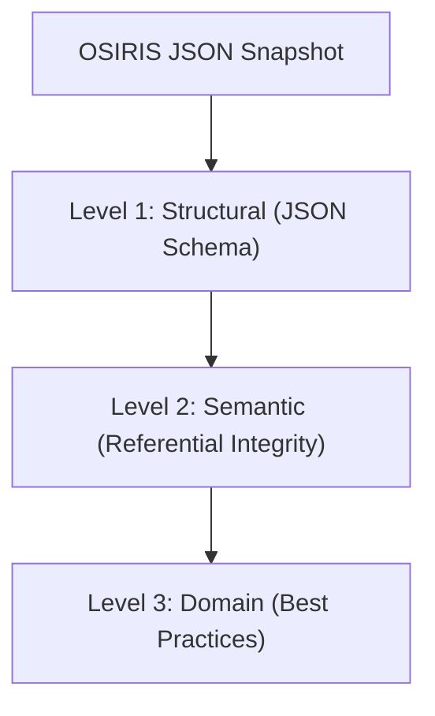

import { CardGrid, Card, Aside } from '@astrojs/starlight/components';

The canonical OSIRIS core validation engine (`@osirisjson/core`) validates OSIRIS JSON documents using a three-tiered approach. This structured model ensures that documents are structurally correct, internally consistent, and follow production-ready modeling practices.

---

## The Three-Level Validation Model

---

## Level 1: Structural Validation

Level 1 validation is schema-based. It verifies that the document is well-formed JSON and complies with the JSON Schema rules defined in `osiris.schema.json`.

### Key Checks
*   **Syntax & Formatting**: Verifies compliant JSON parsing and UTF-8 encoding.
*   **Required Fields**: Ensures the root object includes `version`, `metadata`, and `topology`.
*   **Type & Constraint Matching**: Asserts that `resources`, `connections`, and `groups` are arrays, and that specific properties match defined regex patterns and enums (e.g., connection `direction` must be `inbound`, `outbound`, or `bidirectional`).
*   **JSON Schema Compliance**: Validates against the draft-07 core specification.

<Aside type="danger" title="Level 1 Failures">
  Level 1 violations are critical. Tooling and consumers should immediately halt execution and reject the document if structural validation fails.
</Aside>

---

## Level 2: Semantic Validation

Level 2 validation goes beyond the schema to verify the logical integrity of the topology graph. It ensures that references and relationships inside the document are consistent.

### Key Checks
*   **Referential Integrity**:
    *   Every connection's `source` and `target` MUST map to an existing resource ID in `topology.resources`.
    *   Every group's `members` and `children` MUST map to existing resource or group IDs.
*   **Identifier Uniqueness**: Checks that all resource, connection, and group IDs are unique within the document.
*   **Graph Cycles**: Detects and flags circular dependencies in group hierarchies (e.g., Group A containing Group B, which contains Group A).
*   **Self-Reference Check**: Ensures that a resource or connection does not reference itself.

<Aside type="caution" title="Level 2 Failures">
  Semantic validation failures indicate corrupted or invalid topology state. They are reported as errors by default but can be downgraded to warnings under relaxed testing configurations.
</Aside>

---

## Level 3: Domain Validation

Level 3 validation checks for adherence to modeling best practices, quality hints, and non-invasive security checks. These rules help elevate the quality of the snapshot but do not affect structural validity.

### Key Checks
*   **Namespace Best Practices**: Flags custom extension keys that do not use the lowercase, dot-separated `osiris.*` namespace convention.
*   **Metadata Completeness**: Warns if required metadata elements (like `metadata.scope.description`) are empty.
*   **Redaction Hints**: Identifies if common secret-bearing fields (e.g., fields named `pass`, `token`, `secret`) are present in properties blocks without redaction.
*   **Connection Optimization**: Recommends using `bidirectional` connections instead of two redundant `outbound` connections between the same resources.

<Aside type="note" title="Level 3 Configuration">
  Level 3 findings are emitted as warnings or info messages. They do not trigger non-zero CLI exit codes unless the validator is executed with a strict profile (e.g., `--profile strict`).
</Aside>
